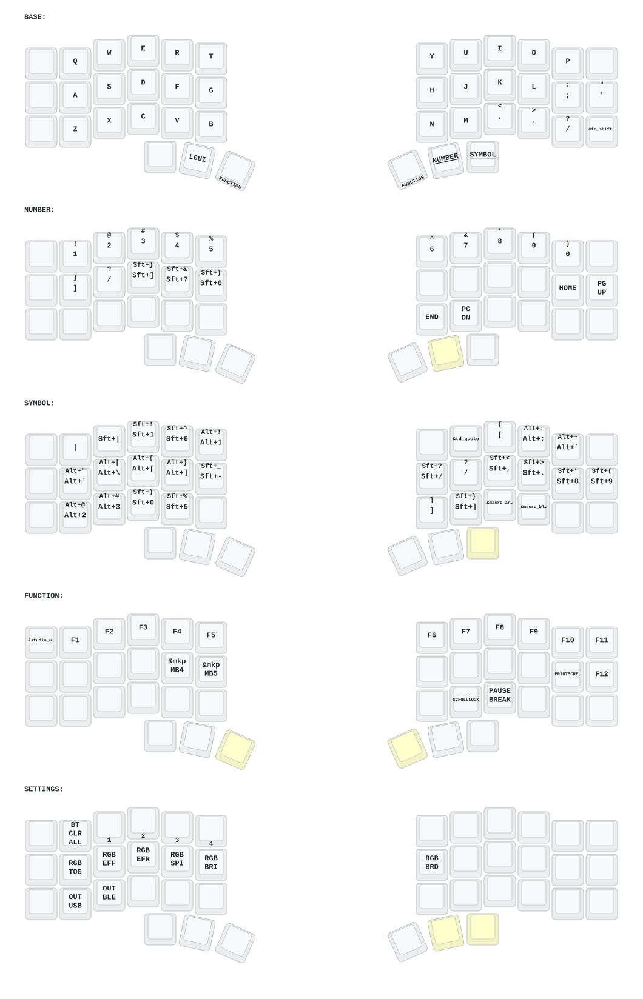
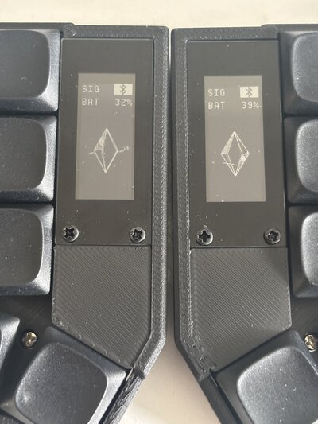
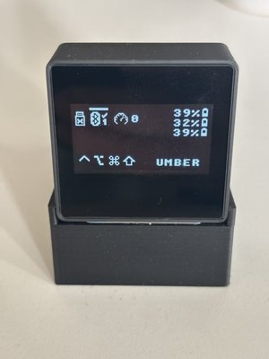

# Corne Dongle - ZMK Keyboard Configuration

Tavomak's custom wireless split keyboard configuration for the Corne keyboard with dongle support, built with ZMK firmware. This configuration features advanced functionality including mouse control, RGB lighting, encoders, and ZMK Studio support.

## ✨ Features

- **🔌 Wireless Dongle Mode**: Central dongle with left and right peripheral halves
- **🖱️ Mouse Support**: Scroll and button clicks via keyboard (no cursor movement by default)
- **🎨 RGB Lighting**: Customizable RGB underglow effects
- **🎡 Rotary Encoder**: Volume control on base layer and scroll on other layers
- **📊 OLED Display**: Battery status, WPM counter, and modifier indicators
- **🔋 Power Efficient**: Optimized power consumption with automatic sleep
- **🎹 ZMK Studio**: Real-time keymap editing support
- **📱 E-Paper Display**: Support for nice!view displays on peripherals
- **⌨️ QWERTY Layout**: Standard QWERTY with 4 customizable layers

## 📋 Hardware Requirements

- **MCU**: 3x nice!nano v2 boards
- **Keyboard**: Corne PCB (compatible with Eyeslash Corne variant)
- **Display**: OLED for central dongle, E-paper displays for peripherals
- **Encoders**: EC11 rotary encoders (optional)
- **Switches**: Cherry MX compatible switches
- **Keycaps**: 42-key set


## 🎨 Keymap Visualization



## ⌨️ Keymap Layers

### Layer 0: BASE (Default)
Standard QWERTY layout with modifier keys and layer access.

- **Tap Dance**: Shift (single tap) / Caps Lock (double tap)
- **Layer-Tap**: Space/Enter activate Layer 3 when held
- **Momentary Layers**: Access to NUMBER and SYMBOL layers

### Layer 1: NUMBER
Numbers, navigation, and system controls.

- **Numbers**: 1-9, 0 on top row
- **Bluetooth**: BT clear, device selection (0-3)
- **RGB Controls**: On/Off, effects, speed, brightness
- **Navigation**: Arrow keys, Home, End, Page Up/Down
- **Mouse**: Scroll control via encoder

### Layer 2: SYMBOL
All symbols and special characters.

- **Top Row**: `! @ # $ % ^ & * ( )`
- **Middle Row**: `- = [ ] \ ` ` with mouse buttons
- **Bottom Row**: `_ + { } | ~`
- **Output Toggle**: Switch between USB and BLE
- **Mouse Buttons**: Left, Middle, Right, MB4, MB5

### Layer 3: FUNCTION
Function keys and system commands.

- **Function Keys**: F1-F12
- **System**: Bootloader, System Reset, Studio Unlock
- **Special Keys**: Print Screen, Scroll Lock, Pause Break
- **Mouse Controls**: Full mouse button support

## 🚀 Building the Firmware


The project uses GitHub Actions for automated builds. Each push will generate firmware files for:

- **Central Dongle** (with OLED display)
- **Left Peripheral** (with E-paper display)
- **Right Peripheral** (with E-paper display)
- **Settings Reset**

## 📝 ZMK Studio

This configuration includes ZMK Studio support for real-time keymap editing:

1. Flash the central dongle with the Studio-enabled firmware
2. Connect via USB
3. Open [ZMK Studio](https://zmk.studio/)
4. Edit your keymap in real-time
5. Changes are saved to the keyboard automatically

## 🔌 Flashing Firmware

1. Download the firmware files from GitHub Actions artifacts
2. Double-tap the reset button on your nice!nano
3. Drag and drop the `.uf2` file to the mounted drive
4. Wait for the board to reboot
5. Repeat for all three boards (central, left, right)


## 📱 Active Widgets

This configuration uses multiple display widgets to enhance the user experience across the central dongle and peripheral keyboards.

### nice!view Widget

The e-paper displays use the [nice!view ZMK widget](https://nicekeyboards.com/nice-view/) which provides:

- **Battery Status**: Real-time battery level indicator
- **Connection Status**: Visual feedback for Bluetooth connectivity
- **Layer Indicators**: Current active layer display
- **WPM Counter**: Words per minute typing speed
- **Low Power Consumption**: E-paper technology for extended battery life



### nice!view Widget Configuration

The peripheral keyboards are configured with `nice_epaper` shield in `build.yaml`:

```yaml
- board: nice_nano_v2
  shield: eyeslash_corne_peripheral_left nice_epaper
- board: nice_nano_v2
  shield: eyeslash_corne_peripheral_right nice_epaper
```

For detailed information about the e-paper widget implementation, check out the [mctechnology17 nice!view widget repository](https://github.com/mctechnology17/zmk-config).

### Dongle Display Widget

The central dongle uses the [zmk-dongle-display module](https://github.com/englmaxi/zmk-dongle-display) which provides enhanced display functionality:

- **Peripheral Battery Status**: Monitor battery levels of left and right keyboard halves
- **Mac Modifiers**: Visual indicators for Command, Option, Control, and Shift keys
- **WPM Counter**: Real-time typing speed display
- **Connection Status**: Bluetooth connectivity feedback for each peripheral
- **Central Dongle Focus**: Optimized display for dongle-based split keyboard setups



### Dongle Display Widget Configuration

The dongle display features are enabled in the configuration:

```conf
CONFIG_ZMK_DONGLE_DISPLAY_DONGLE_BATTERY=y
CONFIG_ZMK_DONGLE_DISPLAY_MAC_MODIFIERS=y
CONFIG_ZMK_DONGLE_DISPLAY_WPM=y
```

This module is particularly useful for monitoring the status of both keyboard halves from a single central display, making it ideal for wireless split keyboard configurations.

For more information, visit the [zmk-dongle-display repository](https://github.com/englmaxi/zmk-dongle-display).


## 🔧 Configuration

### Main Features

```conf
# Sleep timeout: 1 hour of inactivity
CONFIG_ZMK_IDLE_SLEEP_TIMEOUT=3600000

# Encoder support
CONFIG_EC11=y

# Mouse/Pointing device
CONFIG_ZMK_POINTING=y

# Display features
CONFIG_ZMK_DISPLAY=y
CONFIG_ZMK_DONGLE_DISPLAY_DONGLE_BATTERY=y
CONFIG_ZMK_DONGLE_DISPLAY_MAC_MODIFIERS=y
CONFIG_ZMK_DONGLE_DISPLAY_WPM=y

# Bluetooth power
CONFIG_BT_CTLR_TX_PWR_PLUS_8=y
```

### Mouse Configuration

Mouse speed and acceleration can be adjusted in the keymap:

```c
#define ZMK_POINTING_DEFAULT_MOVE_VAL 1200  // Mouse speed
#define ZMK_POINTING_DEFAULT_SCRL_VAL 25    // Scroll speed
```

## 🙏 Acknowledgments

- [ZMK Firmware](https://zmk.dev/) - The keyboard firmware
- [Corne Keyboard](https://github.com/foostan/crkbd) - Original keyboard design
- [nice!view](https://nicekeyboards.com/nice-view/) - E-paper display support
- ZMK Community - For support and contributions
- [mctechnology17](https://github.com/mctechnology17) - nice!view e-paper widget implementation and ZMK configurations
- [englmaxi/zmk-dongle-display](https://github.com/englmaxi/zmk-dongle-display) - Dongle display module for showing peripheral battery status and modifiers

---